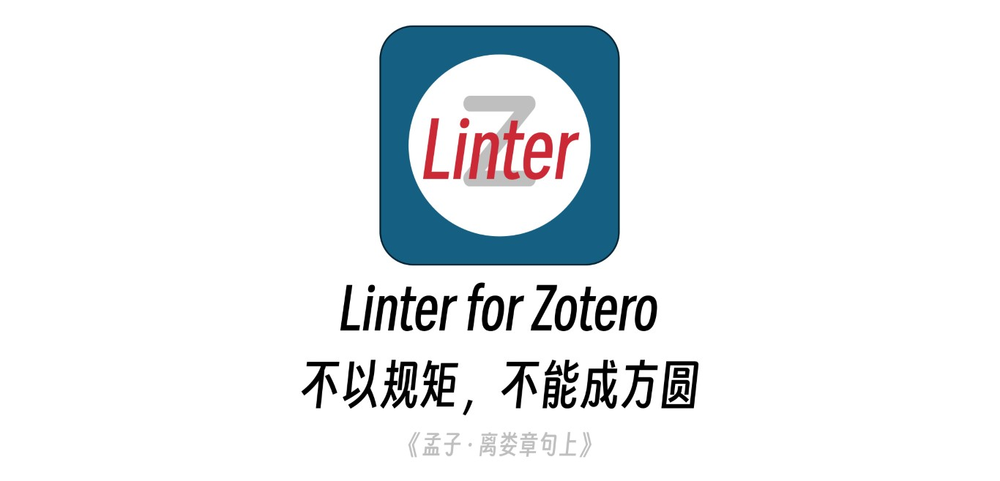
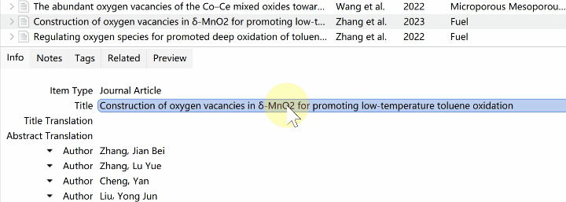
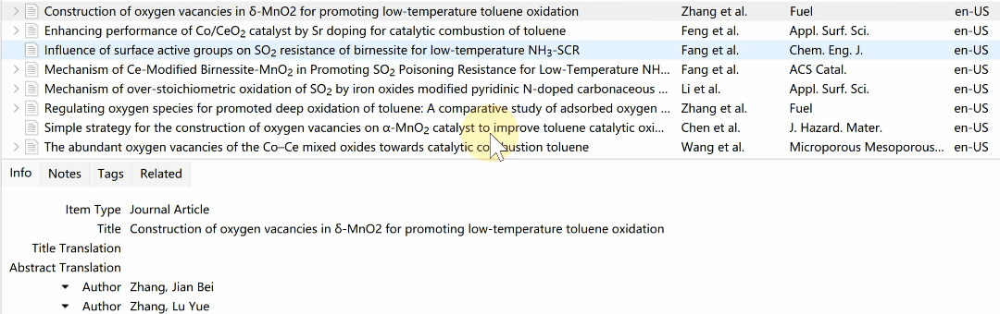

  

本 README 还适用于以下语言：:cn: 简体中文 | [:gb: English](../README.md)

我是一个 [Zotero](https://www.zotero.org/) 插件，可以规范化/格式化条目的元数据（字段数据）。

 

## 特性

### 快速设置上下标、粗体和斜体

Zotero 的参考文献表中的富文本内容需要手动插入 HTML 标签来实现 （详见 [^rich_text_bibliography]），这对于不爱折腾的人来说非常麻烦，虽然 Zotero 的文档上提及将在后续版本支持富文本可视化编辑，然而数年过去了，该议题没有任何进展，故本插件提供了快捷插入这些 HTML 标签的途径。

[^rich_text_bibliography]: <https://www.zotero.org/support/kb/rich_text_bibliography>

#### 快捷键

选中文本后，按下以下快捷键快速应用相应样式：

- 上标：`Ctrl` + `Shift` + `+`
- 下标：`Ctrl` + `=`
- 粗体：`Ctrl` + `B`
- 斜体：`Ctrl` + `I`
- 阻止大写：设置 `class="nocase"` 阻止某些专有名词在 CSL title case 时被大写 (#17)

注：这些快捷键与 Word 中相应快捷键一致。

#### 工具条

编辑“标题”字段时，弹出工具条，编辑完成后单击空白处可以自动关闭工具条。该工具条可以在首选项中彻底关闭。

### 重复条目检查

当新增条目时，插件自动检查该条目是否与库中已有条目重复，若有重复，则提示用户确认。

### 条目类型检查

当添加网页类型条目，且其网址包含学术出版商域名时，提示用户。

todo: 根据网址得到条目标识符并强制更新。

### 将标题转为“句首大写”

Zotero 文档建议将标题存储为“句子式大写”的格式，这将有利于 CSL 对其执行“title case”变换 [^sentenceCase]。Zotero 7 内置了将标题转为“句子式大写”的功能，预置了一些特例识别，本插件在其基础上，增加了针对化学式等的专有名词识别。

详细的测试结果可以参考 [test/toSentenceCase.test.ts](../test/toSentenseCase.test.ts)。

[^sentenceCase]: <https://www.zotero.org/support/kb/sentence_casing>

### 期刊及其期刊缩写

对于期刊标题，插件将使相同的期刊统一。

插件内置了一个包含约 10 万条期刊缩写的数据集（来自 JabRef 和 Woodward Library ），插件将首先在本地数据集里查询期刊缩写；

若无则根据 [ISSN List of Title Word Abbreviations](https://www.issn.org/services/online-services/access-to-the-ltwa/) 推断其缩写（可在首选项中关闭此行为）；

若仍没有找到缩写，则以期刊全称代替（可在首选项中关闭此行为）。

### 根据高校名称填写高校所在地

插件内置了国内高校的名单及其所在地，对于学位论文条目，根据论文的高校填写其所在地，这有利于满足 GB/T 7714-2015 中需要显示出版地的要求 [^gb7714]。

[^gb7714]: <http://www.cessp.org.cn/a258.html>

### 根据 DOI 补全条目的期、卷、页等信息

部分条目在添加时可能因为转换器未获取到、录入时未正式见刊等原因，导致期卷页等信息不完整，插件提供了根据 DOI 补全这些字段的功能。

### 自动填写条目语言

插件根据条目的标题判断其语言，并将识别结果填入“语言字段”，这对于 CSL 完成参考文献表双语排版（如 et al 与 等 混排）非常重要。[^csl-etal]。

默认的，插件被限制仅识别简体中文和英文，你可以在首选项中关闭语言限制或添加其他常用语言的 [ISO 639-3 代码]。

[^csl-etal]: <https://github.com/redleafnew/Chinese-STD-GB-T-7714-related-csl#%E5%A6%82%E4%BD%95%E4%BD%BF%E7%94%A8>

[ISO 639-3 代码]: https://iso639-3.sil.org/code_tables/639/data

### 更多

DOI 去前缀、日期修改为 ISO 格式等。

请阅读 [特性](./features.md)。

## 安装

1. 前往 [发布页](https://github.com/northword/zotero-format-metadata/releases/) 下载 [最新的 `.xpi` 文件](https://github.com/northword/zotero-format-metadata/releases/latest/download/zotero-format-metadata.xpi).  
    - 如果你无法顺利的访问 GitHub，可以前往以下几个镜像站下载本插件。
      - [GitHub Proxy](https://ghproxy.com/?q=https%3A%2F%2Fgithub.com%2Fnorthword%2Fzotero-format-metadata%2Freleases%2Flatest%2Fdownload%2Fzotero-format-metadata.xpi)
      - [Zotero 插件镜像下载 - Zotero 中文社区](https://plugins.zotero-chinese.com/)
    - 如果你使用 FireFox ，请在 XPI 文件的链接上右击，选择“另存为...”。
2. 在 Zotero 中，点击菜单 `工具` -> `附加组件`，将下载的 `.xpi` 文件拖入 Zotero 插件管理器页面。参阅 [如何安装 Zotero 插件](https://zotero.yuque.com/staff-gkhviy/zotero/addons#B2kU3)。

注意：最新版本仅支持 Zotero 7，如果您正在使用 Zotero 6，请下载 [0.4.4 版本](https://github.com/northword/zotero-format-metadata/releases/tag/0.4.4)。

## 变更日志

本插件的主要变更历史列于 [CHANGELOG.md](../CHANGELOG.md) 中。

## Todo

参阅 [Project #1](https://github.com/users/northword/projects/1)。

## Contribution

参阅 [贡献指南](./CONTRIBUTING.md).

## 开源协议

GNU Affero General Public License v3.0

> Permissions of this strongest copyleft license are conditioned on making available complete source code of licensed works and modifications, which include larger works using a licensed work, under the same license. Copyright and license notices must be preserved. Contributors provide an express grant of patent rights. When a modified version is used to provide a service over a network, the complete source code of the modified version must be made available.

本插件继承 Zotero 插件开发模板的 AGPL v3.0 协议，为传染性开源协议。简单的说，你可以商用、修改、分发、专利使用及个人使用本插件。但当修改版本重新分发或用于提供网络服务时，必须注明协议，声明所做出的修改，保持开源且使用相同的协议。

## 替代品

### 富文本 HTML 标签

一些 quicker 动作可用：

- [Supscript](https://getquicker.net/Sharedaction?code=dee60abc-d1f5-40ad-99c3-08d9c6b06ad1)
- [Subscript](https://getquicker.net/Sharedaction?code=b44c0592-89fa-41c2-99c4-08d9c6b06ad1)
- [Bold](https://getquicker.net/Sharedaction?code=dc815b9a-f463-4233-99c5-08d9c6b06ad1)
- [Italic](https://getquicker.net/Sharedaction?code=98c3d460-22b5-49ab-99c2-08d9c6b06ad1)

### 期刊缩写

[zotero-journalabbr] 和 [zotero-updateifsE] 插件也都提供了类似的功能。

[zotero-journalabbr]: https://github.com/zoushucai/zotero-journalabbr
[zotero-updateifsE]: https://github.com/redleafnew/zotero-updateifsE

### 高校地点

韩老师制作了 Quicker 动作：[填充城市](https://getquicker.net/Sharedaction?code=b5506c59-6116-4111-a65e-08db363ab19b)

### 语言识别

[茉莉花](https://gitee.com/l0o0/jasminum) 和 [Delitem](https://github.com/redleafnew/delitemwithatt) 插件也提供了类似的功能，但茉莉花提供的语言识别基于 `nlp.js`，且似是未经预处理的原因，对于标题内含有 HTML 标签或化学式的文本识别效果不佳， Delitem 仅提供了两种语言的直接指定。

本插件基于 franc 库，并针对 HTML 标签进行了处理，提高了识别准确率。然而，如果您对本插件提供的其他功能没有需求，且是茉莉花用户，那么使用茉莉花插件已经可以完全满足，没有必要为了这一丝准确度的提高而额外加载数十兆的本插件。

## 致谢

插件开发过程中参考了如下项目的代码：

- [redleafnew/zotero-updateifsE](https://github.com/redleafnew/zotero-updateifsE)
- [windingwind/zotero-pdf-translate](https://github.com/windingwind/zotero-pdf-translate)
- [windingwind/zotero-pdf-preview](https://github.com/windingwind/zotero-pdf-preview)

开发过程中使用了如下项目的数据：

- [ISO 639-3](https://github.com/wooorm/iso-639-3)
  - [Map of ISO 639-3 to ISO 639-1](https://github.com/amitbend/iso-639-3-to-1/blob/master/6393-6391.json)
- [JabRef/abbr.jabref.org](https://github.com/JabRef/abbrv.jabref.org)
- [中华人民共和国教育部：全国高等学校名单](http://www.moe.gov.cn/jyb_xxgk/s5743/s5744/A03/202110/t20211025_574874.html)
